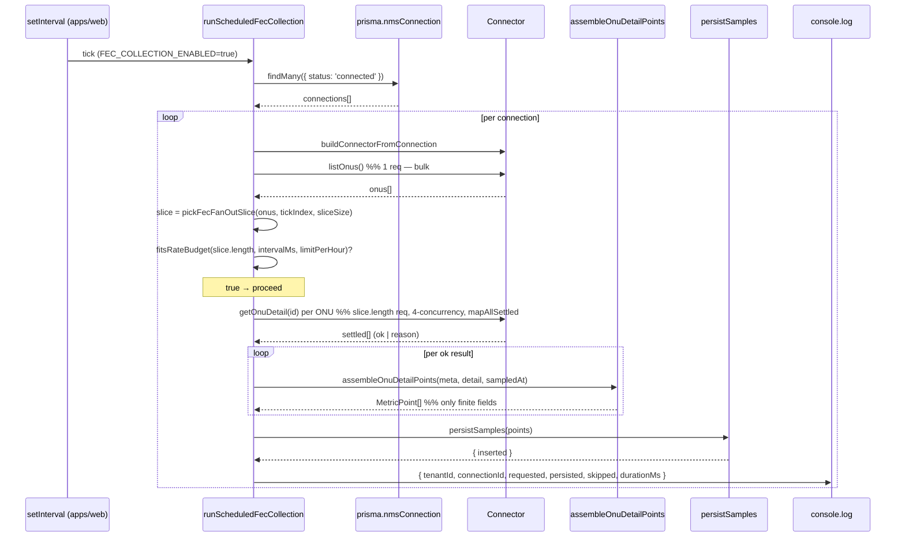
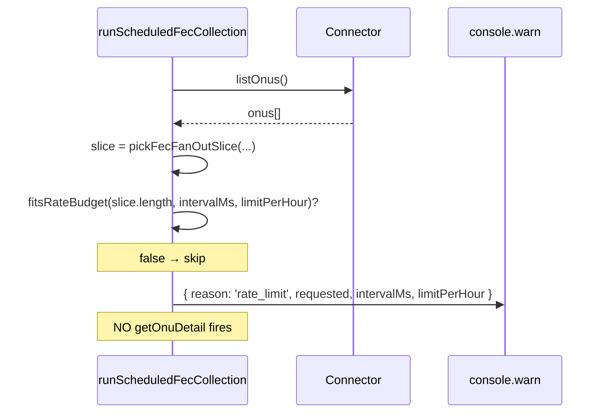

# Design: P2.1 FEC Collection (corrected)

## Technical Approach

A third independent scheduler loop in `apps/web/lib/monitoring/scheduler.ts`. Each tick: pre-flight guard → slice rotation → **inline per-ONU `getOnuDetail` fan-out** → `MetricPoint` assembly → `persistSamples`. No detector call. Detection happens downstream on the freshly persisted rows via the existing scheduled detection job.

`collectSamples` is **not** modified. The fan-out moves into the scheduler because `CollectOptions` (`packages/analytics/src/types.ts:41-58`) only exposes `{ now, includeOltDetail, includeOnuDetail }` — there is no narrowing field, and the fan-out branch in `collect.ts:121-134` targets ALL `listOnus()` ONUs. The scheduler calls `connector.getOnuDetail(id)` per id in the slice, builds `MetricPoint`s with the same shape as `collect.ts:136-161`, and persists the assembled batch.

### 1.1 Scheduler wiring — `apps/web/lib/monitoring/scheduler.ts`

```ts
export async function runScheduledFecCollection(): Promise<void> {
  if (process.env['FEC_COLLECTION_ENABLED'] !== 'true') return;

  const intervalMs   = positiveInt(process.env['FEC_COLLECTION_INTERVAL_MS'], 3_600_000);
  const sliceSize    = positiveInt(process.env['FEC_FAN_OUT_PER_CYCLE'],     8);
  const limitPerHour = positiveInt(process.env['FEC_RATE_LIMIT_PER_HOUR'],   15);
  const tickIndex    = Math.floor(Date.now() / intervalMs);

  const connections = await prisma.nmsConnection.findMany({ where: { status: 'connected' } });

  for (const connection of connections) {
    const meta: SampleMeta = { tenantId: connection.tenantId, connectionId: connection.id };

    let connector: INmsConnector;
    try { connector = buildConnectorFromConnection(connection).connector; }
    catch { continue; }                                                          // skip unbuildable

    let onus: OnuSummary[];
    try { onus = await connector.listOnus(); }
    catch { continue; }                                                          // skip on bulk fail

    const slice = pickFecFanOutSlice(onus, tickIndex, sliceSize);                // pure rotation

    if (!fitsRateBudget(slice.length, intervalMs, limitPerHour)) {               // pre-flight REQ-3
      console.warn('[fec-collection] skipped', {
        tenantId: meta.tenantId, connectionId: meta.connectionId,
        reason: 'rate_limit', requested: slice.length, intervalMs, limitPerHour,
      });
      continue;
    }

    const sampledAt = new Date().toISOString();
    const t0 = Date.now();
    const settled = await mapAllSettled(slice, 4, (onu) => connector.getOnuDetail(onu.id));
    const points: MetricPoint[] = [];
    for (const [i, r] of settled.entries()) {
      const onu = slice[i]!;
      if (r.ok && r.value) points.push(...assembleOnuDetailPoints(meta, r.value, sampledAt));
      // per-ONU failure swallowed — that ONU contributes zero rows (REQ-4 / spec kill-switch).
    }
    const { inserted } = await persistSamples(points);
    console.log('[fec-collection] tick', {
      tenantId: meta.tenantId, connectionId: meta.connectionId,
      requested: slice.length, persisted: inserted,
      skipped: slice.length - points.length, durationMs: Date.now() - t0,
    });
  }
}

export function startFecCollectionLoop(): () => void {
  if (process.env['FEC_COLLECTION_ENABLED'] !== 'true') return () => {};
  const intervalMs = positiveInt(process.env['FEC_COLLECTION_INTERVAL_MS'], 3_600_000);
  const timer = setInterval(() => { runScheduledFecCollection().catch(() => {}); }, intervalMs);
  setTimeout(() => { runScheduledFecCollection().catch(() => {}); }, 5000);
  return () => clearInterval(timer);
}
```

`apps/web/instrumentation.ts` gains one line `startFecCollectionLoop();` after `startFirmwareAuditLoop();` (AD-7: mechanical boot call, no new logic — matches the existing two loops).

### 1.2 Pure helpers — `packages/analytics/src/scheduler-helpers.ts`

`pickFecFanOutSlice` and `fitsRateBudget` keep their prior shape; `assembleOnuDetailPoints` is added next to them. **New constant / types import:** `OnuSummary` from `@ftth-copilot/connectors-core`. All three helpers are pure (no I/O, no globals, no mutation).

```ts
import type { OnuSummary, OnuDetail } from '@ftth-copilot/connectors-core';
import type { MetricPoint, SampleMeta } from './types';

// pickFecFanOutSlice: prior design, unchanged.
// fitsRateBudget:     prior design, unchanged.

/**
 * Bounded-concurrency (4) fan-out with per-item failure capture.
 * Mirrors the semantics of `mapAllSettled` in collect.ts:39-61 — preserved
 * here so we don't need to export a private helper from collect.ts.
 */
export async function mapAllSettled<T, U>(
  items: readonly T[], concurrency: number,
  fn: (item: T, index: number) => Promise<U>,
): Promise<Array<{ ok: true; value: U } | { ok: false; reason: unknown }>> { /* … */ }

/**
 * Assembles MetricPoints for a single OnuDetail, matching the shape that
 * collect.ts:136-161 emits for the same fields. A field that is undefined
 * on the detail (e.g. Mikrowisp's no-FEC case) contributes no point.
 * Pure: no I/O, no Date.now().
 */
export function assembleOnuDetailPoints(
  meta: SampleMeta, detail: OnuDetail, sampledAt: string,
): MetricPoint[] { /* … */ }
```

`packages/analytics/src/index.ts` gains the new re-export:

```ts
export { pickFecFanOutSlice, fitsRateBudget, assembleOnuDetailPoints, mapAllSettled }
  from './scheduler-helpers';
```

## Architecture Decisions

### AD-1 Opt-in default (`FEC_COLLECTION_ENABLED=false`)

| Option | Tradeoff | Decision |
|---|---|---|
| Default `true` | Auto-activates dev/test → noisy DBs, surprise load. | Rejected. |
| Default `false` | Mirrors `FIRMWARE_AUDIT_ENABLED` / `METRICS_POLLER_ENABLED`. | **Chosen.** |

### AD-2 Single `includeOnuDetail: true` covers FEC + optical

Reuse `mergeOnuDetail` semantics implicitly — same fields, same kind union. **No** new `MetricKind`.

### AD-3 Rate-budget formula `perCycle × (3,600,000 / intervalMs) ≤ limitPerHour`

Default `8 × 1 = 8 ≤ 15` — leaves 7 req/h headroom.

### AD-4 Mikrowisp graceful no-op

Detail returns no `fec*` / `biasCurrent*` / `ontTemperature*` → `assembleOnuDetailPoints` emits nothing. Persist zero rows; no throw; loop continues.

### AD-5 `pickFecFanOutSlice` rotation step

`start = (floor(now) × sliceSize) % max(1, n)` clamped. Consecutive tick counters shift start by `sliceSize` → disjoint slices when `n ≥ 2 × sliceSize`.

### AD-6 No changes to `poll.ts`, `collect.ts`, `CollectOptions`

| Option | Tradeoff | Decision |
|---|---|---|
| Add `onusIds?: string[]` to `CollectOptions`; filter in `collect.ts` | Widens analytics API for one caller; changes a file the spec rules out of scope. | **Rejected** (the orchestrator's correction explicitly forbids it — `CollectOptions` has no such field today and the spec does not authorize it). |
| Fan-out lives in the scheduler using the existing `INmsConnector.getOnuDetail` and the existing `MetricPoint` shape | No analytics touch; scheduler owns its own data path; detection unchanged. | **Chosen.** |

### AD-7 Boot point is `apps/web/instrumentation.ts` (one line)

Same as the prior draft. Without it the loop never runs.

### AD-8 Per-ONU fan-out and assembly live in the scheduler

The scheduler owns three responsibilities this design: pre-flight guard, slice rotation, and the inline fan-out + assembly + persistence. Spec REQ-3 requires the guard; REQ-4 requires per-ONU failure isolation (`mapAllSettled`); REQ-5 requires persistence via the existing `persistSamples`. Centralizing these in `runScheduledFecCollection` keeps the contract local, lets the orchestrator reason about one function end-to-end, and avoids widening `collectSamples`'s public surface. `collectSamples` remains a bulk-only collector for the 15-min metrics poller (REQ-1 keeps that loop byte-identical).

## Data Flow — Sequence Diagrams

### Happy path



### Skip path (rate-limited)



## Interfaces / Contracts

```ts
// packages/analytics/src/scheduler-helpers.ts (additive)
export function pickFecFanOutSlice(onus: readonly OnuSummary[], now: number, sliceSize: number): OnuSummary[];
export function fitsRateBudget(perCycle: number, intervalMs: number, limitPerHour: number): boolean;
export function assembleOnuDetailPoints(meta: SampleMeta, detail: OnuDetail, sampledAt: string): MetricPoint[];
export async function mapAllSettled<T, U>(items: readonly T[], concurrency: number, fn: (item: T, i: number) => Promise<U>)
  : Promise<Array<{ ok: true; value: U } | { ok: false; reason: unknown }>>;
```

No `CollectOptions` field added. No signature change to `collectSamples`.

## File Changes

| File | Action | Description |
|---|---|---|
| `apps/web/lib/monitoring/scheduler.ts` | MODIFY (heavy) | Add `runScheduledFecCollection` (per-connection: pre-fetch bulk, slice, pre-flight, fan-out, assemble, persist, log) + `startFecCollectionLoop` + import `INmsConnector` / `OnuSummary` / `OnuDetail` / `SampleMeta` / `MetricPoint` from `@ftth-copilot/connectors-core` and `@ftth-copilot/analytics`. ~80 LOC. Existing two loops stay byte-identical. |
| `apps/web/instrumentation.ts` | MODIFY | One new line: `startFecCollectionLoop();` after `startFirmwareAuditLoop();`. |
| `packages/analytics/src/scheduler-helpers.ts` | ADD | `pickFecFanOutSlice` + `fitsRateBudget` + `assembleOnuDetailPoints` + `mapAllSettled`. ~110 LOC incl. JSDoc. |
| `packages/analytics/src/index.ts` | MODIFY | Re-export the four helpers. ~3 LOC. |
| `packages/analytics/tests/scheduler-helpers.test.ts` | ADD | Pure-helper unit tests (~140 LOC). |
| `apps/web/tests/lib/monitoring/fec-loop.test.ts` | ADD | Scheduler integration test — mock connector, mock prisma, assert slice-scoped persistence (~140 LOC). |
| `docs/roadmap-integraciones-pendientes.md` | MODIFY | Flip §P2.1 status to ✅ shipped; one-line note on env vars + kill switch. |

**Do NOT modify**: `packages/analytics/src/collect.ts`, `packages/analytics/src/types.ts`, `packages/monitoring/src/poll.ts`, `packages/detection`, `packages/alerts`, `packages/soc`, `packages/connectors/*`, `packages/db`, `packages/db/prisma/schema.prisma`, `runScheduledPoll`, `runScheduledFirmwareAudit`. No migration. No new parameter on `collectSamples`.

## Testing Strategy

| Layer | What | Where |
|---|---|---|
| Unit | `pickFecFanOutSlice` determinism, disjointness, no-mutation, edge cases (empty, sliceSize≥n, sliceSize=0). | `packages/analytics/tests/scheduler-helpers.test.ts` |
| Unit | `fitsRateBudget` boundary / invalid-input cases. | same |
| Unit | `assembleOnuDetailPoints` emits one point per finite field (status, rx, tx, uptime, fec*, bias*, ontTemp*); skips `undefined`. | same |
| Unit | `mapAllSettled` order preservation + per-item failure capture. | same |
| Integration | `runScheduledFecCollection`: env off → no-op; env on + default slice → one tick; mocked connector returns `getOnuDetail(id)` per ONU; mocked `prisma.metricSample.createMany` receives ONLY the slice's devices (assert `deviceId` membership); per-ONU failure → that ONU absent from persisted rows; rate-budget skip → no `getOnuDetail` call. | `apps/web/tests/lib/monitoring/fec-loop.test.ts` |

All tests use vitest; `apps/web/tests/lib/monitoring/fec-loop.test.ts` mocks `@ftth-copilot/db`, `@/lib/connectors/chat-client`, and `@ftth-copilot/analytics` (mirrors `apps/web/tests/lib/promote-pending-incidents.test.ts`).

## Threat Matrix

`N/A — no routing, shell, subprocess, VCS/PR automation, executable-file classification, or process-integration boundary.` The fan-out uses the existing `INmsConnector` HTTP client only.

## Migration / Rollout

No migration. Rollback: set `FEC_COLLECTION_ENABLED=false` and restart; the disposer returned by `startFecCollectionLoop` clears the active timer. Alternative: revert the PR.

## Open Questions

None. The pre-proposal handoff fixed default cadence (1 h), default fan-out slice (8), and the opt-in flag (`false`). The spec scenarios are the binding contract; the design satisfies all six.

## Review Budget

~470 LOC across 7 files (heavy: `scheduler.ts` ~80 LOC, `scheduler-helpers.ts` ~110 LOC, two test files ~140 LOC each). Single-PR delivery under the 400-line authored budget if the loop body is tightened, otherwise chain into two PRs (`helpers + types` slice, `scheduler + boot + tests` slice). `delivery_strategy: ask-on-risk`.